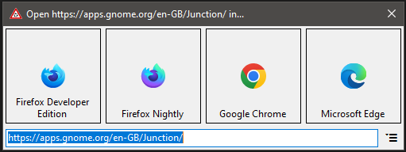

 
# Roundabout

Like Gnome's [Junction](https://apps.gnome.org/en-GB/Junction/), but for Windows 

Roundabout is a Browser selector app that you can set as your default browser, so that when you click a link in any application, it will open a browser choice dialog, allowing you to choose which browser to open that link in.

## Installation
Grab the latest release from the [releases page](https://github.com/LBognanni/Roundabout/releases) and run the installer.

## Usage
After installation, you can set Roundabout as your default browser by going to `Settings > Apps > Default Apps > Web Browser` and selecting Roundabout from the list.

Uninstalling Roundabout will automatically un-register it as a system browser.

## Command line parameters
In order to open a web page with Roundabout, simply run `roundabout.exe <url>`.

You can also use the following command line parameters:
 - `--register` - Registers Roundabout as a system browser
 - `--unregister` - Unregisters Roundabout as a system browser